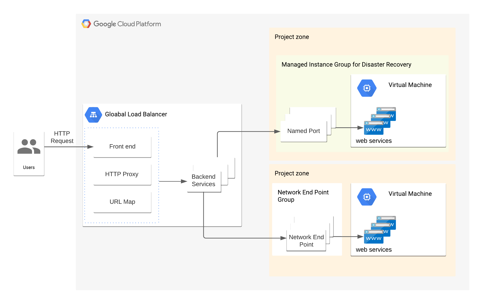

# Loadbalancer setup 

There are two types of virtual machines.

Type 1. An Instance in Managed Instance Group(MIG) - Disaster recovery enabled VM
A managed instance group can be a backend for a load balancer. To connect ports within an instance,
we should do 
- create named ports for MIG 
- create load-balancer backends for the named ports
- map sub-domains to backends

Type 2. An Instance without Instance Group 
To connect an instance with a load balancer, it requires Network Endpoint Group(NEG).
NEG can be a backend of a load balancer. NEG type of backend controls amount of traffic with `rate` per second.
Once you created a NEG, you can add a network endpoint to the NEG.

e.g Terragrunt/Terraform source code. `infrastructure/mmm/qa/mmmapp/test-lb-no-dr` and `modules/attach-load-balancer-on-vm`
You can open `terragrunt.hcl` file under `infrastructure/mmm/qa/mmmapp/test-lb-no-dr` and edit `source_vm` parameter.
This example code will create
 - 1. Network Endpoint Group
 - 2. Network Endpoint for the `source_vm`
 - 3. Load balancer with the backend of the Network Endpoint Group

[Please, click for more information](https://faun.pub/google-cloud-htp-htps-load-balancer-backend-service-with-multiple-ports-8478ada41ce5)

# How load balancer is built
- every module outputs 'named port' or 'network endpoint group'
- at the last stage of `terrafor apply`, load-balancer module aggregates all 'named port' and 'network endpoint group' to build load balancer backends.

# How to expose your service to the Internet
-1. modify `project-level-folder/load-balancer/terragrunt.hcl` to include your module as a dependency.
-2. Add host-and-path rules below the existing host-and-path rule.
-3. In case of using HTTPS front end, your impersonate service account should have 'roles/compute.loadBalancerAdmin' 