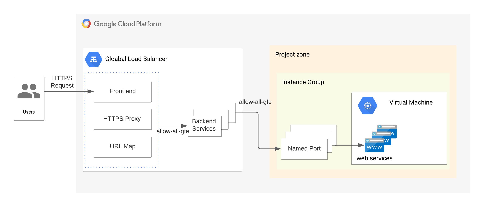

# Loadbalancer setup 




All VM is required to be in an Instance Group to connect to a load balancer

An instance group can be a backend for a load balancer. 
To connect ports within an instance,

we should do 
-1. create named ports for an Instance Group. 
When you use `compute-instance-disaster-recovery` or `disaster-recovery` module, please put the block below.
``` 
 named_ports = [
    {
      name = "https"   # load-balancer will lookup this name
      port = 443
    }
  ]
```

-2. create load-balancer backends for the Instance Group. 
Put the name of the module you like to connect with the load-balancer.
The module must be located under the same directory to resolve the name.
example. 'module.NAME-OF-THE-MODULE.instance_group'

You also need HTTPS certificate in your project to be referenced by load-balancer module

``` 
  source = "./load-balancer"

  project = var.project
  .
  .
  .
     
  # You should upload your certificate to Google Console First
  certificate_name = ["marketshare-certificate"]

  instance_group = module.test-strategy-dr.instance_group
```

If you like to set up load balancer with Google Console, please visit the link.
[Please, click for more information](https://faun.pub/google-cloud-htp-htps-load-balancer-backend-service-with-multiple-ports-8478ada41ce5)

# How to build a load balancer
-1. Create an Instance Group for a VM with `disater-recovery` or `unmanaged-instance-group-to-vm` module. 

These two module output `named port`s

-2. Create a Load-balancer at with `load-balancer` module. 

`load-balancer` module picks up `named ports` from the above.