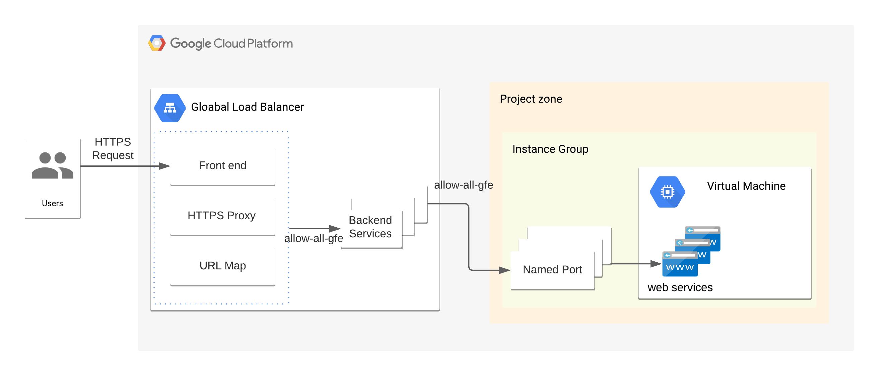

# Loadbalancer setup 



All VM is required to be in an Instance Group to connect to a load balancer

An instance group can be a backend for a load balancer. 
To connect ports within an instance,

we should do 
-1. create named ports for an Instance Group. Add a block to the terragrunt file using `disaster-recovery` or `unmanaged-instance-group-to-vm` module. 
``` 
 named_ports = [
    {
      name = "https"
      port = 443
    }
  ]
```

-2. create load-balancer backends for the Instance Group. Add `dependency` block as well as `instance_group` attribute to the terrgrunt file.
``` 
dependency "test-strategy" {
  config_path = "../test-strategy"
}

inputs = {
  ...
  host_path_rules = [
  {
    instance_group = dependency.test-strategy.outputs.instance_group_manager.instance_group
    ...
  }]
}
```
If you like to set up load balancer with Google Console, please visit the link.
[Please, click for more information](https://faun.pub/google-cloud-htp-htps-load-balancer-backend-service-with-multiple-ports-8478ada41ce5)

# How to build a load balancer
-1. Create an Instance Group for a VM with `disater-recovery` or `unmanaged-instance-group-to-vm` module. 

These two module output `named port`s

-2. Create a Load-balancer at with `load-balancer` module. 

`load-balancer` module picks up `named ports` from the above.

# Summary 
-1. modify `project-level-folder/load-balancer/terragrunt.hcl` to include your Instance Group as a dependency.
  - [add dependency block to the terragrunt.hcl file.](https://terragrunt.gruntwork.io/docs/reference/config-blocks-and-attributes/#dependency)

There are two examples of loadbanacers under `infrastructure/mmm/qa/mmmapp` directory.