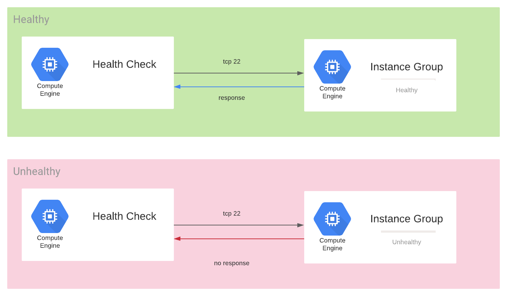
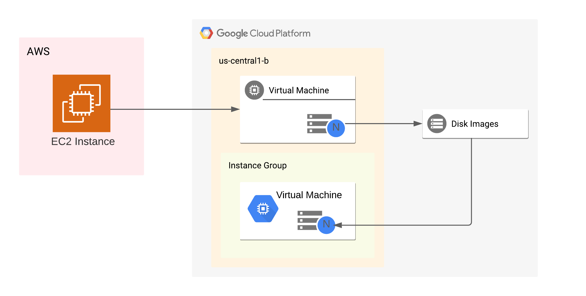

# Terraform script for disaster recovery 




## Preparing
### Install Terraform and GCP SDK to the machine that runs the command.

https://www.terraform.io/downloads.html


https://cloud.google.com/sdk/docs/install

### Directory structure of this project.
Directory structure of this repository reflects the GCP folders and projects structure.
``` 
└── modules
    ├── common
    │   ├── README.md
    │   ├── main.tf
    │   ├── output.tf
    │   └── variables.tf
    ├── compute-instance                     <=== provision a VM
    │   ├── README.md
    │   ├── main.tf
    │   └── variables.tf
    ├── compute-instance-disaster-recovery   <=== provision a VM and create disaster recovery
    │   ├── README.md
    │   ├── main.tf
    │   ├── output.tf
    │   └── variables.tf
    ├── disaster-recovery                   <=== create a disaster recovery
    │   ├── README.md
    │   ├── compute.sh
    │   ├── data.tf
    │   ├── main.tf
    │   ├── output.tf
    │   └── variables.tf
    ├── examples
    │   ├── disaster-recovery-for-existing-vm.tf
    │   └── load-balancer-example.tf
    ├── load-balancer                        <=== attach a load-balancer to an instance group
    │   ├── main.tf
    │   └── variables.tf
    ├── project.auto.tfvars
    ├── project.tf
    └── unmanaged-instance-group-to-vm       <=== wrap a VM with unmanaged instance group to attach load-balancer
        ├── compute.sh
        ├── data.tf
        ├── main.tf
        ├── output.tf
        ├── provider.tf
        ├── variables.tf
        └── versions.tf
```

### Create two service accounts in the GCP
In order to execute this script without any GCP keyfile dowloaded, it uses 
impersonnate service account. 
An impersonnate service account requires two roles:
`service account token creator` and `service account user roles`.
(If you like to create a load balancer with HTTPS frontend, you need 'loadBalancerAdmin' as well)

The impersonnate service account requires network user permission for the network sub-project at which an instance runs. 
A network sub-project has the prefix 'ent-net-mta-host'.

#### List of roles for an impersonnate service account
For the target project it requires at least 5 roles below.
```
Compute Instance Admin (v1)
Compute Network Admin
Compute Network User
Service Account Token Creator
Service Account User
Compute Load Balancer Admin (optional)
```

For the host network project it requires at least 2 roles below.
``` 
Compute network admin 
compute network user roles
```

Along with the impersonnate service account, it requires a service account for a VM being created.
This service account requires at least two roles, those are `compute network admin` and `compute network user` roles. 
When an application needs to access Google Services,
please, ensure that permissions and roles to access it. 

reference: https://cloud.google.com/iam/docs/impersonating-service-accounts

### Stop the VM to take images out of disks 

A VM may have multiple disks. 
You have to take images of all disks.
Fortunately, this script can take images out of all disks
If your source VM is still running, this automatic process will be halted.

reference: https://cloud.google.com/compute/docs/images/create-delete-deprecate-private-images#create_image

## execution
To impersonnate a service account, type the command below in the terminal.
Before typing the command, Google Cloud SDK must be installed on your machine.
``` 
 gcloud auth application-default login 
```

To enable Terraform script calls Google Cloud SDK, type the command below
``` 
 gcloud auth login
```

# Terraform usage
Here's example tf file link [disaster recovery configuration](modules/examples/disaster-recovery-for-existing-vm.tf)

You should create a single *.tf file and execute the file.
```
module "disaster-recovery-for-existing-vm" {
  /*
  Select source directory.

  'disaster-recovery' module will clone a existing VM and create disaster recovery logic
  'compute-instance' module will create a new VM
  'compute-instance-disaster-recovery' module will create a new VM as well disaster recovery logic
  */
  source  = "../disaster-recovery"
  project = "project_name"

  // leave it null if you like to use the same service account of source VM.
  service_account = null

  region = "us-central1"
  zone   = "us-central1-a"

  # labels on disks
  labels = {
    l1 = "k1"
  }

  # You can turn on some metadata feature on a VM.
  # https://cloud.google.com/compute/docs/metadata/overview
  metadata = {
    enable_oslogin = true
  }

  # Disk snapshot configuration
  snapshot = {
    hours              = 1 # Snapshot frequency
    start_time         = "04:00"
    max_retention_days = 1 # how long keep snapshots
  }

  /*
  If you like to change disk size or to add a new disk, please add here.

  Important : Please click Google Console's `Compute Engine -> VM Instances` and `Compute Engine -> Disks` menu and select
  `EQUIVALENT REST` link. Any value different from the `EQUIVALENT REST` link will be applied to the disk.

  !The number of disks must be the same as the number of source_vm's disks
  !The value defined here will overwrite 'source_vm's original value. 
  !If you add additional disk, populate all of disk_name values.
*/
  disks = [
    {
      boot         = null
      auto_delete  = null
      disk_name    = null
      disk_size_gb = null
      disk_type    = null #pd-ssd, local-ssd or pd-standard
      device_name  = null
      labels       = null
      source_image = null
      }, {
      boot         = null
      auto_delete  = null
      disk_name    = null
      disk_size_gb = 60
      disk_type    = null #pd-ssd, local-ssd or pd-standard
      device_name  = null
      labels       = null
      source_image = null
    }
  ]

  # VM to be cloned
  source_vm = "test" #Must be a match of regex '(?:[a-z](?:[-a-z0-9]{0,61}[a-z0-9])?)'

  network_tag = ["allow-all"]
  named_ports = [
    {
      name = "https"  # Load-balancer module will lookup this name
      port = 443
    }
  ]

  # Instance group manager
  igm_initial_delay_sec = "120" # booting time

  # Health check setting
  http_health_check_enabled = false # 'false' to use TCP protocol, 'true' to use HTTP
  health_check = {
    check_interval_sec  = 10
    timeout_sec         = 5
    healthy_threshold   = 2
    unhealthy_threshold = 3
    request_path        = ""
    port                = 22
  }
}
```

### In case you need an external load-balancer 
load-balancer terraform module depends on `disaster-recovery` or `unmanaged-instance-group-to-vm` module to fetch `named-port` information.
 
If you like to how to create a load-balancer, [click link](Loadbalancer.md)

### Clean up - Delete the source VM
If a new VM has multiple disks, mount them first.
Restart the new VM and make sure those disks are still mounted.
Check snapshot schedule and health check are created correctly.

If everything is ok, delete the VM migrated to GCP.